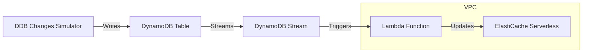
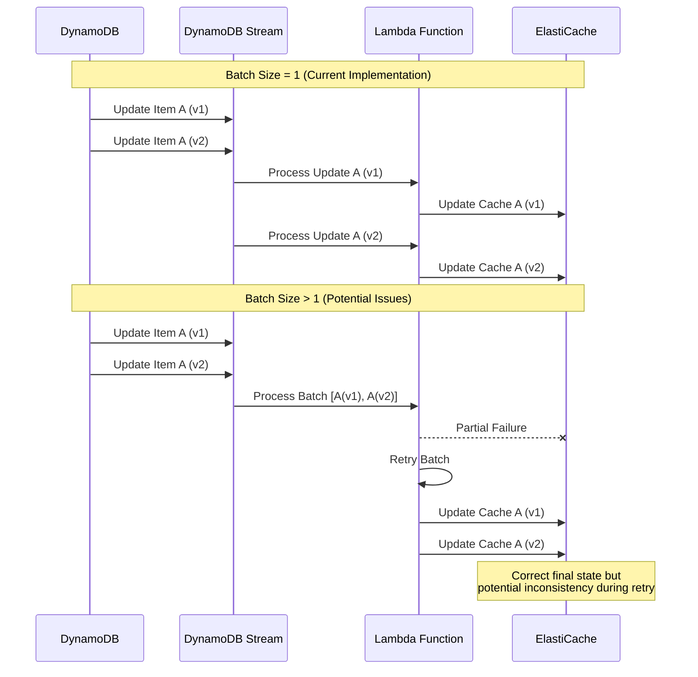

# DynamoDB to ElastiCache Replication Example

## DISCLAIMER
**This project is provided as an example/proof of concept only and is not intended for production use.** It demonstrates architectural patterns and implementation techniques but lacks the comprehensive error handling, security controls, and operational robustness required for production systems. Use this as a learning resource or starting point for your own implementation.

This project demonstrates a real-time data replication pattern from Amazon DynamoDB to Amazon ElastiCache using AWS CDK and TypeScript. It showcases how to maintain data consistency between a DynamoDB table and an ElastiCache cluster using DynamoDB Streams and Lambda functions.

## Architecture Overview

The architecture implements a Change Data Capture (CDC) pattern using DynamoDB Streams to capture changes in the source DynamoDB table and replicate them to an ElastiCache Serverless cluster in real-time.



## Key Components

- **DynamoDB Table**: Source of truth for data with stream enabled
- **DynamoDB Stream**: Captures item-level changes in the table
- **Lambda Function**: Processes stream events and updates ElastiCache
- **ElastiCache Serverless**: Destination cache for high-performance data access
- **VPC Configuration**: Secure network setup for ElastiCache and Lambda
- **DDB Changes Simulator**: Generates sample data changes for demonstration

## Batch Size and CDC Ordering

### Why Batch Size Matters

The project explicitly sets `batchSize: 1` in the DynamoDB Streams to Lambda configuration. This is a critical design decision that directly impacts the ordering guarantees of the Change Data Capture (CDC) process.

#### Impact of Batch Size on Event Ordering:

1. **Batch Size = 1 (Current Implementation)**
   - **Pros**: 
     - Guarantees strict sequential processing of events
     - Ensures that each record is fully processed before moving to the next
     - Prevents partial batch failures that could lead to out-of-order updates
   - **Cons**:
     - Lower throughput due to processing one record at a time
     - Higher Lambda invocation costs

2. **Batch Size > 1**
   - **Pros**:
     - Higher throughput and potentially lower costs
     - Fewer Lambda invocations for the same number of records
   - **Cons**:
     - Risk of partial batch failures
     - If a batch partially fails, some records might be processed out of order
     - Retries of failed batches can lead to duplicate processing



### DLQ Considerations

The project intentionally disables the SQS Dead Letter Queue (`deploySqsDlqQueue: false`) to preserve message ordering. If a DLQ were enabled, failed messages would be sent to the queue and potentially processed out of order when retried, breaking the sequential processing guarantee.

## Deployment and Usage

### Prerequisites

- AWS CLI configured with appropriate permissions
- Node.js and npm installed
- AWS CDK installed (`npm install -g aws-cdk`)

### Setup and Deployment

1. Clone the repository
2. Install dependencies:
   ```
   npm install
   ```
3. Build the project:
   ```
   npm run build
   ```
4. Deploy the stack:
   ```
   npx cdk deploy
   ```

### Testing the Solution

Once deployed, the DDB Changes Simulator will automatically generate random changes to the DynamoDB table every minute. These changes will be:

- Captured by DynamoDB Streams
- Processed by the Lambda function
- Replicated to ElastiCache

You can monitor the process through CloudWatch Logs for the Lambda function.

## DDB Changes Simulator

The project includes a built-in simulator that generates random data changes to demonstrate the replication process without requiring manual input.

### How the Simulator Works

1. **Scheduled Execution**: The simulator runs as a Lambda function triggered by an EventBridge rule every minute
2. **Random Operations**: It performs a configurable number of random operations (default: 10) on the DynamoDB table:
   - Upsert operations (create or update items) - 2/3 probability
   - Delete operations - 1/3 probability
3. **Data Generation**: 
   - Creates items with random IDs (1-100)
   - Assigns random names from a predefined list
   - Adds timestamps to track when changes occurred

### Simulator Configuration

The simulator behavior can be adjusted through environment variables:
- `DYNAMODB_TABLE`: The target DynamoDB table name (automatically set during deployment)
- `CHANGES_COUNT`: Number of random operations to perform in each execution (default: 10)

### Implementation Details

The simulator is implemented as:
- A CDK construct (`DDBChangesSimulator`) that sets up the required infrastructure
- A Lambda function that generates and executes the random operations
- An EventBridge rule that triggers the Lambda on a schedule

This approach provides a continuous stream of realistic data changes that exercise the entire replication pipeline, making it easy to observe and validate the system's behavior without manual intervention.

## Useful Commands

* `npm run build`   compile typescript to js
* `npm run watch`   watch for changes and compile
* `npm run test`    perform the jest unit tests
* `npx cdk deploy`  deploy this stack to your default AWS account/region
* `npx cdk diff`    compare deployed stack with current state
* `npx cdk synth`   emits the synthesized CloudFormation template

## Considerations for Production Use

1. **Error Handling**: Implement more robust error handling and monitoring
2. **Scaling**: Consider adjusting Lambda concurrency limits for higher throughput
3. **Monitoring**: Add CloudWatch alarms for stream iterator age and Lambda errors
4. **Recovery**: Implement a recovery mechanism for extended outages
5. **Security**: Review IAM permissions to ensure least privilege principle

